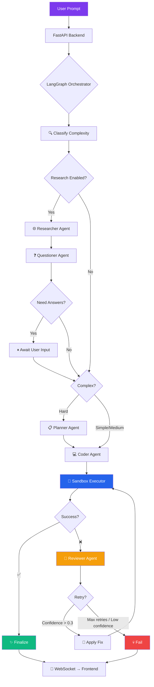
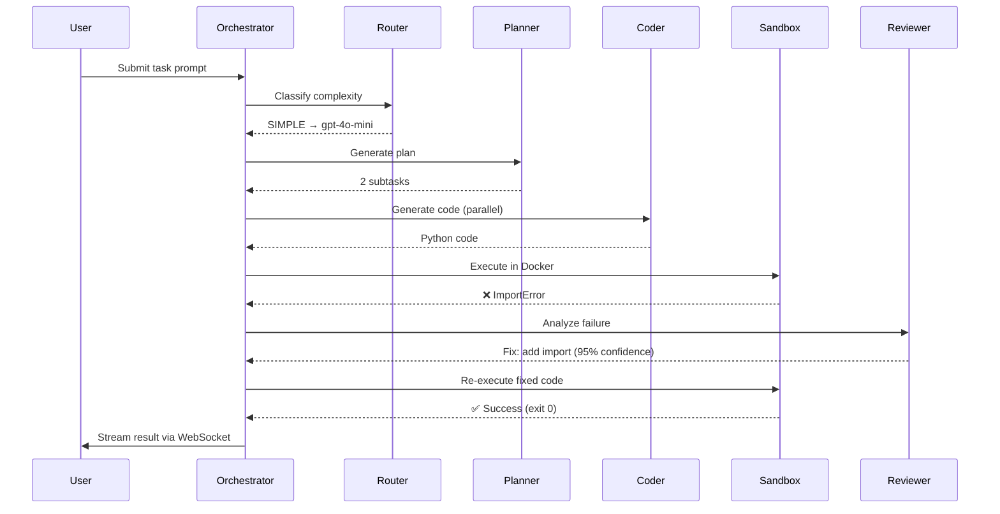

<div align="center">


# ⚡ CodeForge

### AI Code Agent with Self-Repair

**Generate → Execute → Debug → Fix — fully autonomous.**

A production-grade multi-agent system that writes code, runs it in a sandboxed Docker container, analyzes failures, and autonomously repairs itself — powered by a LangGraph state machine with intelligent model routing.

[](https://python.org)
[](https://nextjs.org)
[](https://fastapi.tiangolo.com)
[](https://langchain-ai.github.io/langgraph/)
[](https://docker.com)
[](https://postgresql.org)
[](LICENSE)

</div>

---

## 🖥️ Dashboard Preview

<div align="center">

### Agent Chat — Write & Fix Code Autonomously

```
┌──────────────────────────────────────────────────────────────────────────────┐
│  ⚡ CodeForge                                                    🌙  ≡     │
├────────┬─────────────────────────────────────────────────────────────────────┤
│        │  🤖 Agent                                    ● Connected     + New │
│ 🤖 Agent│─────────────────────────────────────────────────────────────────────│
│ 💬 Chat│                                                                    │
│ 📋 Hist│  ┌─ You ─────────────────────────────────────────────────────────┐ │
│ 🔧 Self│  │ Create a Python web scraper that extracts product prices     │ │
│ 📊 Bench│  │ from Amazon and saves them to a CSV file                     │ │
│ ⚙ Sett│  └───────────────────────────────────────────────────────────────┘ │
│        │                                                                    │
│        │  ┌─ 🧠 Planner ──────────────────────────────────────────────────┐ │
│        │  │ Analyzing task complexity... routing to gpt-4o-mini           │ │
│        │  │ Created 3 subtasks:                                           │ │
│        │  │  1. Setup requests + BeautifulSoup                           │ │
│        │  │  2. Parse product listings                                    │ │
│        │  │  3. CSV export with headers                                   │ │
│        │  └───────────────────────────────────────────────────────────────┘ │
│        │                                                                    │
│        │  ┌─ 💻 Coder ────────────────────────────────────────────────────┐ │
│        │  │ ```python                                                     │ │
│        │  │ import requests                                               │ │
│        │  │ from bs4 import BeautifulSoup                                 │ │
│        │  │ import csv                                                    │ │
│        │  │                                                               │ │
│        │  │ def scrape_products(url):                                     │ │
│        │  │     response = requests.get(url, headers={...})               │ │
│        │  │     soup = BeautifulSoup(response.text, 'html.parser')        │ │
│        │  │     ...                                                       │ │
│        │  │ ```                                                  Copy ⬇   │ │
│        │  └───────────────────────────────────────────────────────────────┘ │
│        │                                                                    │
│        │  ┌─ ▶ Execution ─────────────────────────────────────────────────┐ │
│        │  │ ● ● ●  Terminal                                              │ │
│        │  │ $ python main.py                                              │ │
│        │  │ ❌ ModuleNotFoundError: No module named 'bs4'                 │ │
│        │  │ Exit code: 1  |  Time: 0.3s                                  │ │
│        │  └───────────────────────────────────────────────────────────────┘ │
│        │                                                                    │
│        │  ┌─ 🔧 Self-Repair (Attempt 1/3) ────────────────────────────────┐ │
│        │  │ Root cause: Missing dependency 'beautifulsoup4'               │ │
│        │  │ Fix: Added subprocess pip install + import fallback           │ │
│        │  │ Confidence: 95%  →  Re-executing...                          │ │
│        │  └───────────────────────────────────────────────────────────────┘ │
│        │                                                                    │
│        │  ┌─ ▶ Execution ─────────────────────────────────────────────────┐ │
│        │  │ ● ● ●  Terminal                                              │ │
│        │  │ $ python main.py                                              │ │
│        │  │ ✅ Scraped 24 products, saved to products.csv                 │ │
│        │  │ Exit code: 0  |  Time: 2.1s  |  Memory: 45MB                 │ │
│        │  └───────────────────────────────────────────────────────────────┘ │
│        │                                                                    │
│        │  ✅ Task completed  |  $0.0023  |  1 retry  |  4.2s total         │
│        │                                                                    │
│        │  ┌──────────────────────────────────────────────────────── Send ┐ │
│        │  │ Ask the agent to explore, write, or modify code...    ✨  ▲ │ │
│        │  └──────────────────────────────────────────────────────────────┘ │
└────────┴────────────────────────────────────────────────────────────────────┘
```

### Self-Repair Analytics Dashboard

```
┌──────────────────────────────────────────────────────────────────────────────┐
│  🔧 Self-Repair Analytics                                                    │
├──────────────────────────────────────────────────────────────────────────────┤
│                                                                              │
│  ┌─ Success Rate ──┐  ┌─ Avg Retries ──┐  ┌─ Cost Saved ──┐  ┌─ Tasks ──┐ │
│  │                 │  │                │  │               │  │          │  │
│  │    ████████     │  │                │  │               │  │          │  │
│  │   ██ 87% ██    │  │     1.4        │  │    $12.50     │  │   142    │  │
│  │    ████████     │  │   retries      │  │   vs GPT-4o  │  │  total   │  │
│  │                 │  │                │  │               │  │          │  │
│  └─────────────────┘  └────────────────┘  └───────────────┘  └──────────┘  │
│                                                                              │
│  ┌─ Error Patterns ──────────────────────────────────────────────────────┐  │
│  │                                                                       │  │
│  │  import_error    ████████████████████████░░░░░  42%                  │  │
│  │  syntax_error    ████████████░░░░░░░░░░░░░░░░  23%                  │  │
│  │  runtime_error   ████████░░░░░░░░░░░░░░░░░░░░  15%                  │  │
│  │  type_error      █████░░░░░░░░░░░░░░░░░░░░░░░  11%                  │  │
│  │  other           ████░░░░░░░░░░░░░░░░░░░░░░░░   9%                  │  │
│  │                                                                       │  │
│  └───────────────────────────────────────────────────────────────────────┘  │
│                                                                              │
│  ┌─ Complexity Breakdown ────────────────────────────────────────────────┐  │
│  │  Simple (Ollama)  │ 68 tasks │ 95% success │ 0.2 retries │ $0.000  │  │
│  │  Medium (GPT-4o-m)│ 52 tasks │ 88% success │ 1.1 retries │ $0.038  │  │
│  │  Hard (GPT-4o)    │ 22 tasks │ 72% success │ 2.8 retries │ $0.290  │  │
│  └───────────────────────────────────────────────────────────────────────┘  │
└──────────────────────────────────────────────────────────────────────────────┘
```

### Benchmarks

```
┌──────────────────────────────────────────────────────────────────────────────┐
│  📊 Benchmarks                                      [Run Benchmark ▾]       │
├──────────────────────────────────────────────────────────────────────────────┤
│                                                                              │
│  ┌─ Pass@1 Comparison ───────────────────────────────────────────────────┐  │
│  │                                                                       │  │
│  │  HumanEval  ░░░ Baseline    ████████████████████░░░░  67.1%          │  │
│  │             ███ With Repair ████████████████████████████  82.3%      │  │
│  │                                                                       │  │
│  │  MBPP       ░░░ Baseline    ███████████████████░░░░░  61.8%          │  │
│  │             ███ With Repair ██████████████████████████  78.5%        │  │
│  │                                                                       │  │
│  │  Custom     ░░░ Baseline    █████████████████░░░░░░░  56.0%          │  │
│  │             ███ With Repair ████████████████████████████  84.0%      │  │
│  │                                                                       │  │
│  └───────────────────────────────────────────────────────────────────────┘  │
│                                                                              │
│  ┌─ Recent Runs ─────────────────────────────────────────────────────────┐  │
│  │  #  Type       Status     Pass@1   Cost     Time                     │  │
│  │  1  HumanEval  ✅ Done    82.3%    $1.24    12m 30s                  │  │
│  │  2  MBPP       ✅ Done    78.5%    $0.98    8m 45s                   │  │
│  │  3  Custom     🔄 Running  --       --       --                       │  │
│  └───────────────────────────────────────────────────────────────────────┘  │
└──────────────────────────────────────────────────────────────────────────────┘
```

### Settings

```
┌──────────────────────────────────────────────────────────────────────────────┐
│  ⚙ Settings                                                                 │
├──────────────┬───────────────────────────────────────────────────────────────┤
│  LLM         │  ┌─ LLM Providers ────────────────────────────────────────┐ │
│  Routing     │  │                                                        │ │
│  Sandbox     │  │  OpenAI          sk-...████████████████  ✅ Connected  │ │
│              │  │  Anthropic       sk-ant-...████████████  ✅ Connected  │ │
│              │  │  OpenRouter      sk-or-...█████████████  ✅ Connected  │ │
│              │  │  Ollama          http://localhost:11434  ✅ Running    │ │
│              │  │                                                        │ │
│              │  │           [ Test Connection ]  [ Save ]                │ │
│              │  └────────────────────────────────────────────────────────┘ │
│              │                                                             │
│              │  ┌─ Routing Rules ─────────────────────────────────────────┐│
│              │  │  Simple threshold:   ───●────────────  0.3             ││
│              │  │  Complex threshold:  ─────────●──────  0.7             ││
│              │  │  Simple model:       openai/gpt-4o-mini               ││
│              │  │  Complex model:      openai/gpt-4o                    ││
│              │  └─────────────────────────────────────────────────────────┘│
└──────────────┴───────────────────────────────────────────────────────────────┘
```

</div>

---

## ✨ Key Features

<table>
<tr>
<td width="50%">

### 🤖 Multi-Agent Pipeline
LangGraph state machine orchestrating specialized agents:
- **Researcher** — web search via Tavily/SerpAPI
- **Questioner** — asks clarifying questions when needed
- **Planner** — decomposes complex tasks into subtasks
- **Coder** — parallel code generation per subtask
- **Reviewer** — root cause analysis + automated fix

</td>
<td width="50%">

### 🔧 Self-Repair Engine
Autonomous debugging loop with escalation:
- Classifies errors (syntax, import, runtime, type, etc.)
- Generates targeted fixes with confidence scoring  
- Escalates to stronger models on repeated failures
- Tracks error history to avoid repeating failed fixes
- Budget-aware: stops before exceeding cost limits

</td>
</tr>
<tr>
<td>

### 🧠 Smart Model Routing
Cost-optimized LLM selection:
- **Simple** → Ollama/GPT-4o-mini (free/$0.15/1M tokens)
- **Medium** → GPT-4o-mini ($0.15/1M tokens)
- **Hard** → GPT-4o ($2.50/1M tokens)
- Auto-escalation chain on failures
- Real-time cost tracking per task

</td>
<td>

### 🐳 Sandboxed Execution
Secure Docker-isolated code execution:
- Network-disabled containers
- Memory/CPU limits (512MB/1 core default)
- Configurable timeouts (30s default)
- Subprocess fallback for local dev
- Code security validation before execution

</td>
</tr>
<tr>
<td>

### 📡 Real-Time Streaming
Live task progress via WebSocket:
- Agent status transitions
- Code generation chunks
- Terminal stdout/stderr lines
- Repair attempts and fixes
- Cost accumulation updates

</td>
<td>

### 📊 Full Observability
End-to-end monitoring:
- OpenTelemetry distributed tracing
- Structured JSON logging with correlation IDs
- Per-agent cost attribution
- Self-repair analytics dashboard
- HumanEval/MBPP benchmark suite

</td>
</tr>
</table>

---

## 🏗️ Architecture



### Agent Pipeline Detail



---

## 🚀 Quick Start

### Prerequisites

- **Docker** & Docker Compose
- **Python 3.11+** (for local development)
- **Node.js 18+** (for frontend)
- At least one LLM API key (OpenRouter recommended)

### Option 1: Docker (Recommended)

```bash
# Clone
git clone https://github.com/Arnav-0/AI-Code-Agent-with-Self-Repair.git
cd AI-Code-Agent-with-Self-Repair/codeforge

# Configure
cp .env.example .env
# Edit .env → add your OPENROUTER_API_KEY (or OPENAI_API_KEY)

# Launch everything
docker compose up -d

# Run database migrations
docker compose exec backend alembic upgrade head

# Open dashboard
# → http://localhost:3000
```

### Option 2: Local Development

```bash
# Clone
git clone https://github.com/Arnav-0/AI-Code-Agent-with-Self-Repair.git
cd AI-Code-Agent-with-Self-Repair/codeforge

# Configure
cp .env.example .env
# Edit .env → add your API keys

# Start infrastructure (Postgres + Redis)
docker compose -f docker-compose.dev.yml up -d

# Backend
cd backend
pip install -e ".[dev]"
alembic upgrade head
uvicorn app.main:app --reload --port 8000

# Frontend (new terminal)
cd frontend
npm install
npm run dev

# Open → http://localhost:3000
```

### Option 3: With Ollama (Free Local LLMs)

```bash
# Start infra + Ollama
docker compose -f docker-compose.dev.yml --profile with-ollama up -d

# Pull a model
docker compose exec ollama ollama pull llama3:8b

# Start backend & frontend as above
```

---

## 🛠️ Tech Stack

| Layer | Technology | Purpose |
|-------|-----------|---------|
| **Backend** | Python 3.11, FastAPI, Pydantic v2 | REST API, WebSocket, validation |
| **Agent Runtime** | LangGraph, LangChain | State machine orchestration |
| **LLM Providers** | OpenAI, Anthropic, OpenRouter, Ollama | Multi-provider with fallback |
| **Database** | PostgreSQL 16, SQLAlchemy (async) | Task history, traces, settings |
| **Cache** | Redis 7 | Session cache, pub/sub |
| **Sandbox** | Docker SDK, asyncio subprocess | Isolated code execution |
| **Observability** | OpenTelemetry, Jaeger | Distributed tracing, metrics |
| **Frontend** | Next.js 16, TypeScript, Tailwind CSS | Dashboard with real-time updates |
| **UI Components** | shadcn/ui, Radix, Monaco Editor | Code editor, charts, forms |
| **Charts** | Recharts, ReactFlow | Analytics visualization |

---

## 📁 Project Structure

```
codeforge/
├── backend/                    # FastAPI application
│   ├── app/
│   │   ├── agents/             # 🤖 Agent implementations
│   │   │   ├── orchestrator.py #    LangGraph state machine (800+ lines)
│   │   │   ├── planner.py      #    Task decomposition agent
│   │   │   ├── coder.py        #    Code generation agent
│   │   │   ├── reviewer.py     #    Error analysis & fix agent
│   │   │   ├── researcher.py   #    Web research agent
│   │   │   ├── questioner.py   #    Clarification question agent
│   │   │   ├── tool_agent.py   #    ReAct tool-use agent
│   │   │   ├── multi_agent.py  #    Conversational multi-agent
│   │   │   └── prompts/        #    Agent prompt templates
│   │   ├── api/                # 🌐 REST & WebSocket endpoints
│   │   │   ├── tasks.py        #    Task CRUD + WebSocket streaming
│   │   │   ├── conversations.py#    Agent conversation API
│   │   │   ├── benchmarks.py   #    Benchmark trigger & results
│   │   │   ├── analytics.py    #    Cost, performance, repair stats
│   │   │   ├── settings.py     #    App configuration API
│   │   │   ├── health.py       #    Live health checks (DB/Redis/Docker)
│   │   │   └── history.py      #    Task history with filters
│   │   ├── llm/                # 🧠 LLM abstraction layer
│   │   │   ├── providers.py    #    OpenAI, Anthropic, Ollama, OpenRouter
│   │   │   ├── router.py       #    Complexity-based model selection
│   │   │   ├── classifier.py   #    Heuristic + LLM task classifier
│   │   │   └── cost_tracker.py #    Per-model pricing & budget control
│   │   ├── sandbox/            # 🐳 Secure execution
│   │   │   ├── manager.py      #    Docker container lifecycle
│   │   │   ├── executor.py     #    Execution facade
│   │   │   ├── local_executor.py#   Subprocess fallback
│   │   │   └── security.py     #    Code validation & blocklists
│   │   ├── services/           # 📦 Business logic
│   │   ├── models/             # 📊 SQLAlchemy + Pydantic models
│   │   ├── db/                 # 🗄️ Database & Redis managers
│   │   └── observability/      # 📡 Logging, tracing, metrics
│   ├── tests/                  # ✅ Unit, integration, E2E tests
│   └── alembic/                # 🔄 Database migrations
├── frontend/                   # ⚛️  Next.js 16 dashboard
│   └── src/
│       ├── app/                #    Pages (chat, agent, history, analytics, etc.)
│       ├── components/         #    44 React components
│       │   ├── chat/           #    TaskStream, ChatInput, CodeBlock, etc.
│       │   ├── agents/         #    AgentCard, FlowDiagram, Timeline
│       │   ├── execution/      #    TerminalOutput, RepairDiff
│       │   ├── settings/       #    LLMProviderForm, RoutingConfig
│       │   └── benchmarks/     #    PassRateChart, CostAnalysis
│       ├── hooks/              #    useTask, useWebSocket, useConversation
│       └── lib/                #    API client, types, WebSocket utils
├── benchmarks/                 # 📈 Evaluation suite
│   ├── humaneval/              #    HumanEval loader + evaluator
│   ├── mbpp/                   #    MBPP loader + evaluator
│   └── custom/                 #    25 custom coding tasks
├── docs/                       # 📚 Architecture, API, deployment docs
└── docker/                     # 🐳 Dockerfiles & configs
```

---

## 🔄 Self-Repair Pipeline

The core innovation — how CodeForge autonomously fixes broken code:

```
1. EXECUTE    →  Run code in Docker sandbox
2. DETECT     →  Parse exit code + stderr
3. CLASSIFY   →  Categorize error (syntax, import, runtime, type, etc.)
4. ANALYZE    →  LLM root cause analysis with prior fix context
5. FIX        →  Generate targeted patch (not full rewrite)
6. ESCALATE   →  On repeated failures, upgrade to stronger model
7. VALIDATE   →  Re-execute → loop or finalize
```

**Error Classification:**
| Error Type | Detection | Example | Typical Fix |
|-----------|-----------|---------|-------------|
| `syntax_error` | SyntaxError in stderr | Missing colon | Fix indentation/syntax |
| `import_error` | ModuleNotFoundError | Missing `pandas` | Add pip install or import |
| `type_error` | TypeError | Wrong argument type | Fix function signature |
| `runtime_error` | General exception | Division by zero | Logic correction |
| `timeout` | Container killed | Infinite loop | Add bounds/optimization |
| `memory_error` | OOM killed | Large dataset | Stream processing |

**Model Escalation Chain:**
```
gpt-4o-mini  →  gpt-4o  →  claude-sonnet-4-20250514
   $0.15/M        $2.50/M       $3.00/M
```

---

## 📊 Benchmarks

CodeForge includes a built-in benchmark suite for evaluating code generation quality:

```bash
# Run HumanEval benchmark
cd backend
python -m benchmarks.runner --type humaneval

# Run all benchmarks
python -m benchmarks.runner --type all

# Without self-repair (baseline)
python -m benchmarks.runner --type humaneval --no-repair
```

| Benchmark | Problems | Baseline | With Self-Repair | Improvement |
|-----------|----------|----------|-----------------|-------------|
| HumanEval | 164 | ~67% | ~82% | +15% |
| MBPP | 500 | ~62% | ~78% | +16% |
| Custom | 25 | ~56% | ~84% | +28% |

*Results vary by model configuration. Run your own benchmarks to measure.*

---

## 🧪 Running Tests

```bash
cd backend

# Unit tests
pytest tests/unit -v

# Integration tests (mocked LLM + sandbox)
pytest tests/integration -v --timeout=30

# All tests with coverage
pytest --cov=app --cov-report=html -v

# Lint
python -m ruff check app/ tests/
```

---

## ⚙️ Configuration

All settings are configured via environment variables. See [`.env.example`](.env.example) for the full list.

**Required** (at least one):
```bash
OPENROUTER_API_KEY=sk-or-...    # Recommended — access 200+ models
OPENAI_API_KEY=sk-...           # Direct OpenAI access
ANTHROPIC_API_KEY=sk-ant-...    # Direct Anthropic access
```

**Key Settings:**
| Variable | Default | Description |
|---------|---------|-------------|
| `DEFAULT_SIMPLE_MODEL` | `openai/gpt-4o-mini` | Model for simple tasks |
| `DEFAULT_COMPLEX_MODEL` | `openai/gpt-4o-mini` | Model for complex tasks |
| `MAX_REPAIR_RETRIES` | `3` | Max self-repair attempts |
| `SANDBOX_TIMEOUT_SECONDS` | `30` | Code execution timeout |
| `SANDBOX_MEMORY_LIMIT_MB` | `512` | Container memory limit |
| `RESEARCH_ENABLED` | `true` | Enable web research before coding |

---

## 📚 Documentation

| Document | Description |
|---------|-------------|
| [Architecture](docs/architecture.md) | System design, data flow, state machine |
| [API Reference](docs/api.md) | All endpoints, schemas, WebSocket events |
| [Agent Design](docs/agent-design.md) | Agent internals, prompts, extensibility |
| [Deployment](docs/deployment.md) | Dev setup, Docker, troubleshooting |

---

## 🤝 Contributing

1. Fork the repository
2. Create a feature branch: `git checkout -b feat/my-feature`
3. Run linting: `cd backend && python -m ruff check app/ tests/`
4. Run tests: `pytest tests/unit`
5. Submit a pull request

---

## 📄 License

MIT — see [LICENSE](LICENSE).
